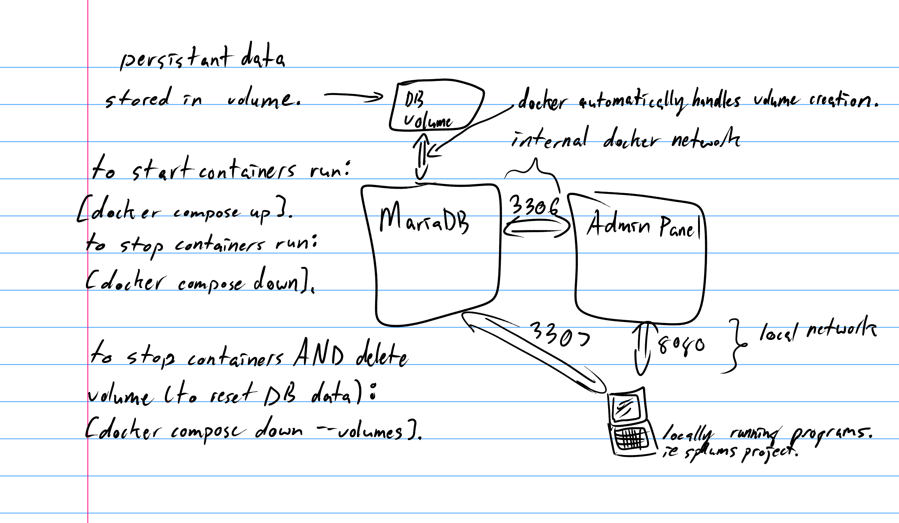

# Student Projects Lab User Management System

## SETUP

*General Information*

All python code related to the core project is going to be placed in the splums directory. Test files will be placed in tests. Files related to running the containers are in containers. Documentation files are in docs. 

*DEPENDENCY SETUP*

Before the project can be ran on your system you will need to install the required python dependencies:

 - sqlalchemy
 - python-opencv

It is recommended to install the pip packages in a python virtual environment. This basically creates an isolated set of packages specific to this project. This avoids conflicts with pre-existing python projects (usually incompatible versions). 

To perform the setup you may run the script `"install_dependencies.sh"`. This installs the virtual environment and pip packages. This might not work for you depending on your os but you can also use it as a template and type the commands manually. You will then need to manually activate the virtual environment **each new terminal session.** To activate the virtual environment type "`. .venv/bin/activate`" in the root directory of the project. When the virtual environment is activated you should see (.venv) to the left of your prompt. 

*SPAWNING AND USING CONTAINERS / MariaDB*

To launch the MariaDB database, go into the containers directory and run `"docker compose up"`. This will spawn the containers attached to the terminal
that you run the command in. This is useful to be able to view the logs in realtime if things aren't working properly. You can also run with
`"docker compose up -d"` to spawn them as background processess. To stop the containers run `"docker compose down"`. It may be necessary if you want
to reset everything to run `"docker compose down --volumes"`. This removes the volumes associated with the containers. (volumes store persistent data)

MariaDB is exposed to your local network through port 3307 to avoid complications with pre-existing MariaDB installations on the default port (3306). The internal docker network communicates through MariaDB on the default port of 3306.

You can login to the admin panel by going to localhost:8080 in your web browser to test logging into the database and to see if its all working.
Since docker is exposing MariaDB on port 3307 this is the port used to connect to the MariaDB database with an SQL Alchemy engine connection. 
I have created a user splums, with a database splums. The configuration information is in the compose file, but that is what you would connect to with SQL Alchemy.

## Statement of Work
Develop a database management system with the following functions:
1. Maintain the following information about lab users:
   1. WIN
   2. Name
   3. Photo
   4. Approved equipment
2. Allow lab users to swipe into and out of the lab using their Bronco ID to pass through an access control gate.
   1. There should be a tower light attached to indicate the following information:
      1. The tower light should light up green if the user is approved to enter the lab.
      2. The tower light should light up red if the user is not approved to enter the lab.
   2. If someone attempts to pass through the gate without having approval, an attached alarm will go off.
   3. An attached monitor will update when a user swipes through the gate to indicate the following information about the user:
      1. Name
      2. Photo
      3. Approved equipment
   4. Card readers should be included on either side of the gate so users will swipe for both entry and exit.
      1. Emergency entrance/exit will be possible, but alarm will sound.
3. Attendants should have a console allowing them access to the system.
   1. Attendants should be able to swipe their Bronco ID and enter a password to log into the system.
   2. Attendants should be able to add new users to the system.
      1. A webcam will need to be included with the attendant computer to allow for taking photos to attach to user profiles.
   3. Attendants should have a second screen showing an at a glance overview of the following information:
      1. Overview of all currently checked in lab users, including:
         1. Name
         2. Photo
         3. List of approved equipment
         4. Indicator of any notes left on the profile
      2. Total count of how many people are currently swiped into the room.
   4. Attendants should be able to select a user profile to view any notes about them, as well as add new notes and edit or remove existing notes
4. Administrator should have a console allowing them access to the system.
   1. Administrator should be able to do anything to the system that attendants can do, as well as make direct modifications to the database.
   2. Administrator should be able to add new attendants to the system and promote existing users to attendants.
   3. Administrator should have the ability import up to date list of user equipment certifications that are exported from Brighspace/Elearning.
   4. Administrator should have the ability to add and manage notes on lab users and attendants, including notes that are viewable to administrators only.

This system should function on an air-gapped LAN using several PCs and embedded hardware in order to protect the personally identifying information of the lab users.

